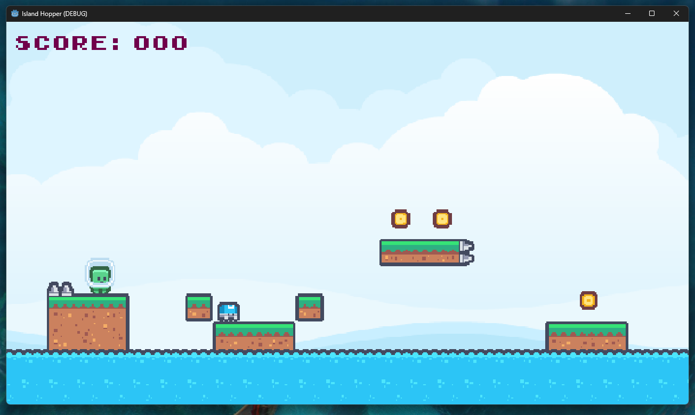
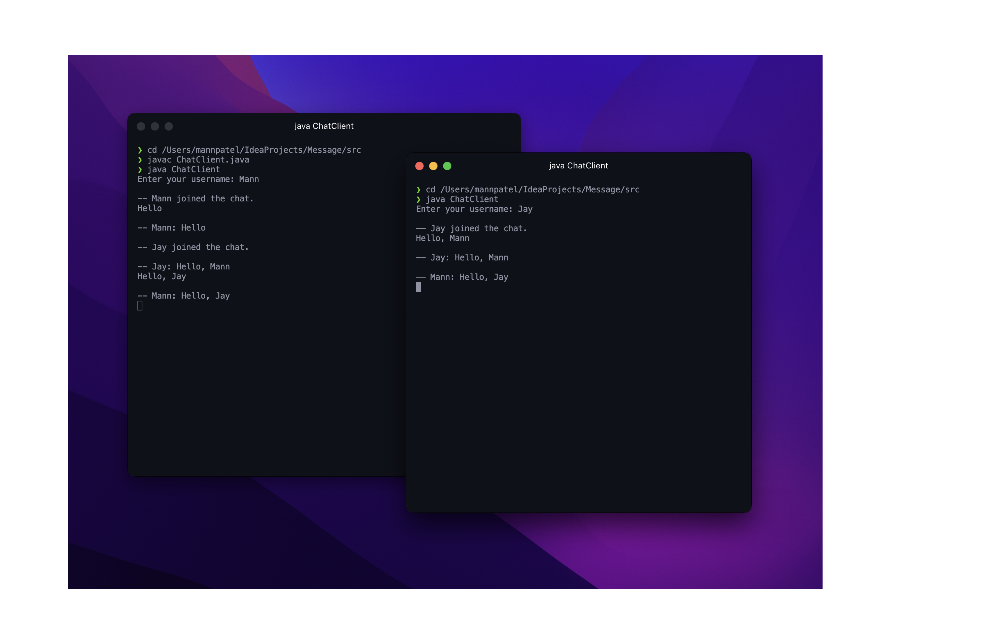

# Mann Patel

## About Me

Hello, I'm Mann Patel, a Senior Software Engineer based in [Your Location]. I specialize in front-end development and am passionate about crafting beautiful user experiences and engaging in the software development lifecycle.

## Projects

### Project 1: Point Of Sale System

- **Description**: Description of the Point Of Sale System project.
- **Technologies Used**: [List technologies used].
- **[View Project](#)**

### Project 2: Island Hopper

- **Description**: Description of the Island Hopper project.
- **Technologies Used**: [List technologies used].
- **[View Project](#)**

### Project 3: Green House Simulation

- **Description**: Description of the Green House Simulation project.
- **Technologies Used**: [List technologies used].
- **[View Project](#)**

### Project 4: Terminal Chat Room

- **Description**: Description of the Terminal Chat Room project.
- **Technologies Used**: [List technologies used].
- **[View Project](#)**

## Skills

- Python
- Java
- JavaScript
- Next.js
- Data Structures
- Algorithms
- Database Management

## Experience

- **Senior Software Engineer** - Company Name (Year - Year)
  - Engaged in front-end development, focusing on creating seamless user experiences.
  
## Education

- **Bachelor's Degree in Computer Science** - Institution Name (Year - Year)

## Contact Me

Feel free to reach out to me on [LinkedIn](https://linkedin.com/in/mann-patel-18624a295) or send me an email at [PatelMann@proton.me](mailto:PatelMann@proton.me).

---

&copy; 2024 Mann Patel
